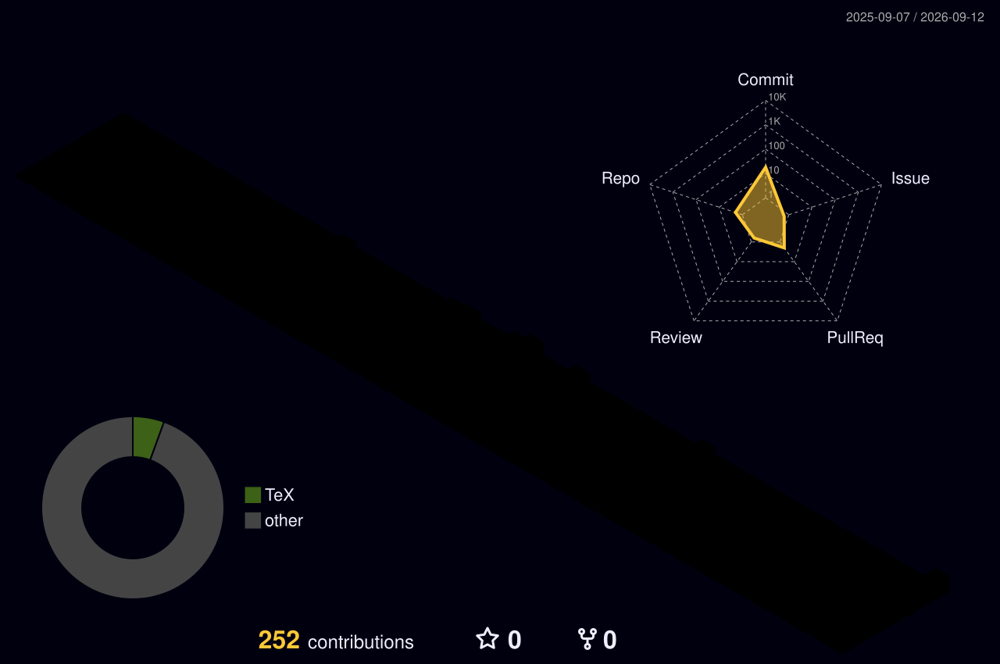

<div align="center">

<!-- ═══════════════ HEADER ═══════════════ -->


<!-- ═══════════════ TYPING ═══════════════ -->


<!-- ═══════════════ SOCIAL ═══════════════ -->
<p>
  <a href="https://www.linkedin.com/in/diego-arias-654426250/">
    
  </a>
  <a href="mailto:ariasdiego570@gmail.com">
    
  </a>
  <a href="https://github.com/DiegoArias32">
    
  </a>
  
</p>

<p>
  
  
  
  
</p>


</div>

<br/>

##  Diego De Jesús Arias González


I'm **20**, based in Neiva, Colombia. Between January and July 2026 I built and maintained **six enterprise applications running in production** at **ElectroHuila S.A. E.S.P.**, a regional power utility — web and mobile, from database schema to CI/CD pipeline.

Three things that period taught me:

🔌 **Legacy data is where the real work is.** I integrated new applications with Oracle 19c and external corporate systems (ERP, SIEC, payroll), and built a management dashboard consolidating KPIs from five separate databases into one view.

🚢 **Shipping is part of the job.** I ran Jenkins CI/CD pipelines and then led the migration to Coolify, giving QA and production automated deploys on `git push`.

📡 **Field constraints beat clean abstractions.** ServiCampo had to work offline in rural areas, so it syncs to Oracle when a signal comes back — not when the architecture diagram says it should.

On my own time I built a full ChatGPT-style platform: hybrid RAG over pgvector, four LLM providers, Stripe billing, LLM observability.

<br clear="right"/>

###  Quick facts

<table>
<tr><td>💼 <b>Most recent</b></td><td>Software Developer @ ElectroHuila S.A. E.S.P. · Jan – Jul 2026</td></tr>
<tr><td>🎓 <b>Education</b></td><td>Tecnólogo en Análisis y Desarrollo de Software — SENA · 2024 – 2026</td></tr>
<tr><td>🏆 <b>Certified</b></td><td>Claude Code in Action — Anthropic · 2026</td></tr>
<tr><td>🗣️ <b>Languages</b></td><td>Spanish (native) · English (intermediate)</td></tr>
<tr><td>🌍 <b>Looking for</b></td><td>Backend / full-stack roles — remote or relocation</td></tr>
<tr><td>🎮 <b>Off the clock</b></td><td>Games, experimental AI side projects, picking up new languages</td></tr>
</table>


## 🧭 The road so far

```text
2022 ──● Bachiller Técnico en Sistemas Informáticos — IPC Andrés Rosa
        │
2024 ──● Started ADSO at SENA — backend, frontend, DB modelling, secure development
        │
2026 ──● ElectroHuila · Jan–Jul
        │  ├─ 6 enterprise apps shipped to production
        │  ├─ Oracle 19c + ERP / SIEC / payroll integrations
        │  ├─ Jenkins → led the migration to Coolify
        │  └─ Claude Code in Action — Anthropic certification
        │
 now ──● Building Electro IA · open to backend & full-stack roles worldwide
```


##  What I've built

### 🏭 ElectroHuila — six applications in production

> **Live systems** at a regional power utility · Built end to end, from schema to deploy
> *Private company repositories — happy to walk through the architecture or share a code sample on request.*

<table>
<tr>
<th align="left">Application</th>
<th align="left">What it does</th>
</tr>
<tr>
<td>📅 <b>PQR Scheduling</b></td>
<td>Customer appointment booking with real-time notifications over WhatsApp, email and SignalR, plus QR-code check-in</td>
</tr>
<tr>
<td>🗺️ <b>ServiCampo</b></td>
<td>Offline-first Flutter app for managing electrical easements in the field — satellite maps, photo capture, automatic Oracle sync</td>
</tr>
<tr>
<td>📊 <b>Indicadores Gerenciales</b></td>
<td>Executive dashboard consolidating KPIs from five databases (commercial, technical, HR, quality, finance)</td>
</tr>
<tr>
<td>📄 <b>Actas</b></td>
<td>Automates contractual and pre-contractual paperwork, cutting document turnaround time</td>
</tr>
<tr>
<td>🏢 <b>Corporate Intranet</b></td>
<td>Portal launching 27+ internal applications, with news and integrated management system</td>
</tr>
</table>

<table>
<tr><td>🧱 <b>Stack</b></td><td>Laravel · .NET · Next.js · Flutter</td></tr>
<tr><td>🗄️ <b>Data</b></td><td>Oracle 19c, incl. external systems (ERP, SIEC, payroll) · SQL Server · PostgreSQL · MySQL</td></tr>
<tr><td>🔐 <b>Security</b></td><td>JWT authentication with role-based access control</td></tr>
<tr><td>⚙️ <b>DevOps</b></td><td>Jenkins pipelines → led migration to Coolify, <code>git push</code> deploys to QA and production</td></tr>
</table>

<p align="center">

</p>

---

### 🤖 Electro IA — AI chat platform

> **Personal project** · A ChatGPT-style product built end to end: RAG, multimodal input, subscriptions

<details open>
<summary><b>🧠 AI layer</b></summary>
<br/>

- **Hybrid retrieval** — pgvector HNSW similarity (72%) + lexical matching (25%) + recency boost (3%), over PDFs, plain text and GitHub repos
- **Four providers** behind the Vercel AI SDK: Claude · GPT · Gemini · local Ollama
- **Intent routing** across 11 categories, with a math short-circuit, automatic web search via Tavily, and context-window trimming
- **Multimodal** — OCR through Tesseract.js, image messages, streamed responses

</details>

<details open>
<summary><b>🏗️ Platform layer</b></summary>
<br/>

- Clerk auth with webhook sync · Stripe Free/Pro tiers · token metering with a 30-day reset
- Upstash Redis rate limiting · Langfuse + Sentry for observability
- Turborepo: Next.js 15 · Hono edge API · Drizzle ORM · Neon PostgreSQL

</details>

<p align="center">

</p>

<p align="center">
<code>pgvector</code> <code>Hono</code> <code>Drizzle</code> <code>Vercel AI SDK</code> <code>Clerk</code> <code>Langfuse</code> <code>Sentry</code> <code>Upstash</code> <code>Turborepo</code>
</p>

<!--
═══════════════════════════════════════════════════
PINNED REPO CARDS — uncomment once Electro IA is public
═══════════════════════════════════════════════════
<div align="center">
<a href="https://github.com/DiegoArias32/electro-ia">
  
</a>
</div>

═══════════════════════════════════════════════════
TEMPLATE — copy this block for each new project
═══════════════════════════════════════════════════
### 🔧 Project name
> One line on what it is and who it's for

Two or three sentences: the problem, the interesting technical decision, the outcome.

**Stack:** ...
[Live demo](#) · [Code](#)
-->


## 🛠️ Tech Stack

<div align="center">

<table>
<tr>
<td align="center" width="96"><br/><sub><b>C#</b></sub></td>
<td align="center" width="96"><br/><sub><b>.NET</b></sub></td>
<td align="center" width="96"><br/><sub><b>PHP</b></sub></td>
<td align="center" width="96"><br/><sub><b>Laravel</b></sub></td>
<td align="center" width="96"><br/><sub><b>React</b></sub></td>
<td align="center" width="96"><br/><sub><b>Next.js</b></sub></td>
<td align="center" width="96"><br/><sub><b>TypeScript</b></sub></td>
<td align="center" width="96"><br/><sub><b>Flutter</b></sub></td>
<td align="center" width="96"><br/><sub><b>Docker</b></sub></td>
</tr>
</table>

<details>
<summary><b>📦 Full stack — click to expand</b></summary>

<br/>

**Backend & APIs**


**Frontend & Mobile**


**Databases**


**DevOps & Tools**


<br/>


**Testing**


</details>

</div>


## 📊 GitHub Analytics

<div align="center">


<br/>


</div>

<!--
═══════════════════════════════════════════════════════════════
SELF-HOSTED CARDS — see SETUP.md §7
The public instances of these three are permanently over quota
(402 / 503). Deploy your own on Vercel, replace TU-APP below,
then uncomment. Takes about 10 minutes, free forever.
═══════════════════════════════════════════════════════════════

<div align="center">


</div>
-->

<!--
═══════════════════════════════════════════════════════════════
WORKFLOW-GENERATED — uncomment AFTER the Actions run green
3D calendar  → .github/workflows/profile-3d-contrib.yml
Metrics      → .github/workflows/metrics.yml (needs a CLASSIC token)
═══════════════════════════════════════════════════════════════

<div align="center">




</div>
-->

> 💡 Most of my production work lives in private and company repositories, so these numbers don't tell the whole story. Ask me about the architecture instead — I'd rather talk through a design decision than a commit count.


## 🏆 Achievements

<div align="center">


<br/>


</div>


<div align="center">

## 🤝 Let's talk

**Open to backend and full-stack roles — remote or relocation, worldwide.**

<br/>

<a href="https://www.linkedin.com/in/diego-arias-654426250/">
  
</a>
<a href="mailto:ariasdiego570@gmail.com">
  
</a>
<a href="https://github.com/DiegoArias32">
  
</a>

<br/><br/>


<br/>

<!-- ═══════════════ SNAKE ═══════════════ -->
<picture>
  <source media="(prefers-color-scheme: dark)" srcset="https://raw.githubusercontent.com/DiegoArias32/DiegoArias32/output/github-contribution-grid-snake-dark.svg"/>
  <source media="(prefers-color-scheme: light)" srcset="https://raw.githubusercontent.com/DiegoArias32/DiegoArias32/output/github-contribution-grid-snake.svg"/>
  
</picture>

<br/>


</div>
